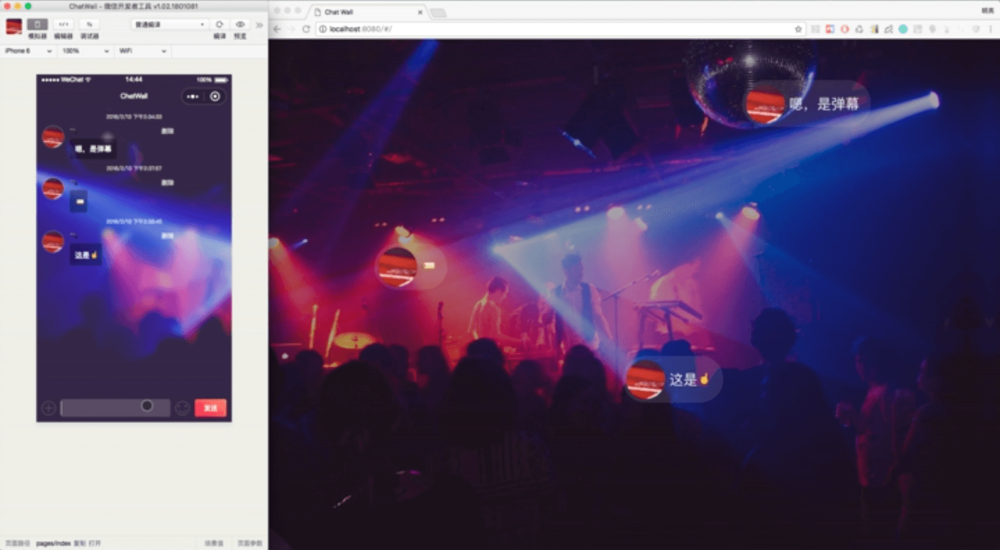

# ChatWall 群聊弹幕小程序



## 使用前安装 WePY 并下载PC端项目

```
npm install wepy-cli -g
```
了解更多，查看 [WePY文档](https://tencent.github.io/wepy/document.html#/)

**下载PC端弹幕墙：** [ChatWall-Vue](https://github.com/MiGongOrg/ChatWall-Vue.git)

## 如何使用

**注意:** 在使用前请查看 WePY 文档中所提到的 [重要提醒](https://tencent.github.io/wepy/document.html#/?id=重要提醒)

PC端的弹幕墙效果，请下载并运行 [ChatWall-Vue](https://github.com/MiGongOrg/ChatWall-Vue.git) 项目

安装依赖

```
npm install
```

开启实时编译

```
wepy build --watch
```